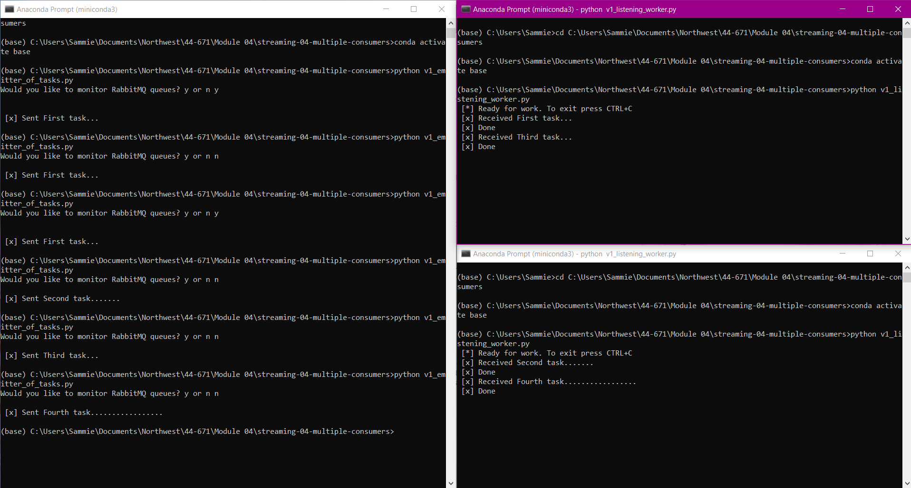
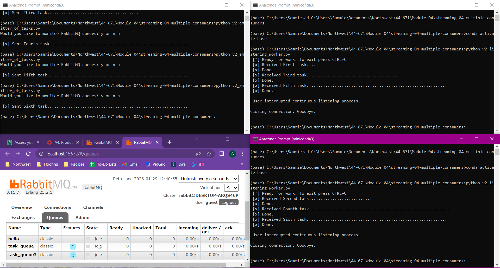
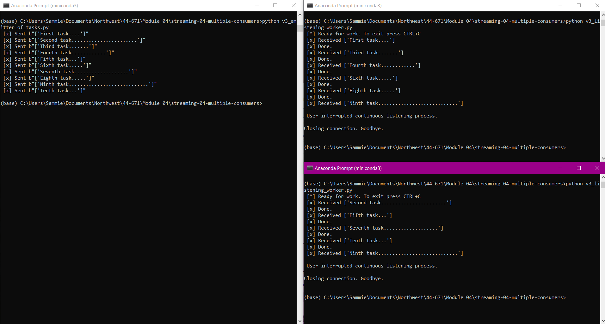

# Sammie Bever - Streaming Data - Module 04 Assignment - January 27, 2023
Organization: Both versions (v1 and v2) do the same thing. Just the organization is different. Version 2 keeps from repeating itself by defining names of the queue, host, message, etc. Version 2 is the best practice for organization.

V3 was written by me and reads from a csv file (as we did in module 2)

## streaming-04-multiple-consumers

> Use RabbitMQ to distribute tasks to multiple workers

One process will create task messages. Multiple worker processes will share the work. 

## Before You Begin

1. Fork this starter repo into your GitHub.
1. Clone your repo down to your machine.
1. View / Command Palette - then Python: Select Interpreter
1. Select your conda environment. 

## Read

1. Read the [RabbitMQ Tutorial - Work Queues](https://www.rabbitmq.com/tutorials/tutorial-two-python.html)
1. Read the code and comments in this repo.

## RabbitMQ Admin 

RabbitMQ comes with an admin panel. When you run the task emitter, reply y to open it. 

(Python makes it easy to open a web page - see the code to learn how.)

## Execute the Producer

1. Run emitter_of_tasks.py (say y to monitor RabbitMQ queues)

Explore the RabbitMQ website.

## Execute a Consumer / Worker

1. Run listening_worker.py

Will it terminate on its own? How do you know? No, code says you need to use a keyboard interrupt to close

## Ready for Work

1. Use your emitter_of_tasks to produce more task messages.

Don't like that you have to manually change the message each time you run the file to get a new task.

## Start Another Listening Worker 

1. Use your listening_worker.py script to launch a second worker. 

Follow the tutorial. 
Add multiple tasks (e.g. First message, Second message, etc.)
How are tasks distributed? 
Monitor the windows with at least two workers. 
Which worker gets which tasks? It alternates which worker gets the tasks

## Reference

- [RabbitMQ Tutorial - Work Queues](https://www.rabbitmq.com/tutorials/tutorial-two-python.html)

## Screenshot

See a running example with at least 3 concurrent process windows here:

### Sammie Bever's Example (v1)
GitHub Link - 

Using file name (PNG) -

### Sammie Bever's Example (v2)
GitHub Link - 

Using file name (PNG) -

### Sammie Bever's Example (v3)
GitHub Link - 

Using file name (PNG) -

